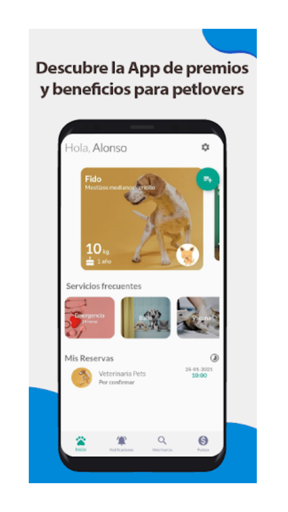
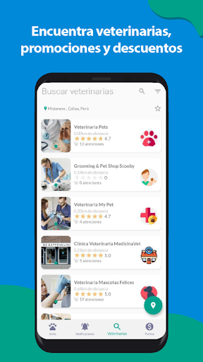
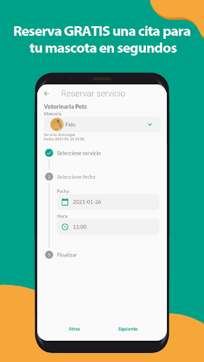
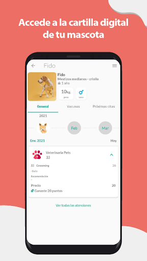
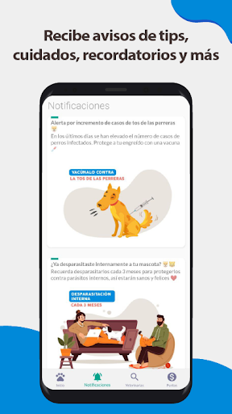

# 🐾 PetLover – App de Gestión Veterinaria

**PetLover** es una aplicación móvil gratuita desarrollada con Flutter, diseñada para ayudar a los dueños de mascotas a gestionar y recordar las citas veterinarias. Permite reservar servicios como baños, consultas, vacunaciones y desparasitaciones en veterinarias afiliadas, ofreciendo beneficios por cada reserva realizada.

---

## 🚀 Características Principales

- 📅 **Agenda de Citas**: Programa y gestiona citas para diversos servicios veterinarios.
- 🔔 **Recordatorios Automáticos**: Recibe notificaciones push para recordar las próximas citas y tratamientos.
- 🧾 **Historial Clínico Digital**: Almacena y accede al historial de salud de tu mascota en cualquier momento.
- 🐶 **Gestión Multimascota**: Administra la información y citas de múltiples mascotas desde una sola cuenta.
- 🎁 **Beneficios por Reservas**: Obtén recompensas y descuentos al reservar servicios a través de la app.

---

## 🛠️ Tecnologías Utilizadas

- **Flutter** – Framework de desarrollo multiplataforma.
- **Supabase** – Backend como servicio:
  - Autenticación de usuarios.
  - Base de datos PostgreSQL.
  - Almacenamiento de archivos.
- **Firebase Cloud Messaging (FCM)** – Para el envío de notificaciones push.
- **Provider** – Gestión de estado en Flutter.

---

## 📦 Instalación y Configuración

1. Clona este repositorio:

   ```bash
   git clone https://github.com/joalmr/petlover-app-flutter-fcm-supabase.git
   cd petlover-app-flutter-fcm-supabase
   ```

2. Instala las dependencias:
   ```bash
   flutter pub get
   ```

3. Configura las variables de entorno:
   - Crea un archivo .env en la raíz del proyecto.
   - Agrega tus credenciales de Supabase y FCM según el formato proporcionado en .env.example.

4. Ejecuta la aplicación:
   ```bash
   flutter run
   ```

---

## 🧠 Aprendizajes y Desafíos
- Durante el desarrollo de PetLover, se abordaron varios retos técnicos, entre ellos:
- Integración de Supabase como backend completo, aprovechando sus servicios de autenticación, base de datos y almacenamiento.
- Implementación de notificaciones push utilizando Firebase Cloud Messaging.
- Diseño de una arquitectura escalable y mantenible utilizando Provider para la gestión de estado.

---

## 📌 Estado del Proyecto
Este proyecto se encuentra en desarrollo activo. Se planea implementar las siguientes funcionalidades en futuras versiones:
- 📍 Integración con mapas para localizar clínicas y servicios cercanos.
- 🧑‍⚕️ Perfil profesional para veterinarios y groomers.
- 💬 Chat en tiempo real entre clientes y profesionales.

---

## 🤝 Contribuciones
¡Las contribuciones son bienvenidas! Si deseas colaborar, por favor sigue estos pasos:
    ```bash
    1. Haz un fork del repositorio.
    2. Crea una nueva rama (git checkout -b feature/nueva-funcionalidad).
    3. Realiza tus cambios y haz commit (git commit -am 'Agrega nueva funcionalidad').
    4. Haz push a la rama (git push origin feature/nueva-funcionalidad).
    5. Abre un Pull Request.
    ```

---

## 📬 Contacto
Puedes contactarme desde mi portafolio:
👉 [https://joalmr.vercel.app](https://joalmr.vercel.app)

---

## Proypet






